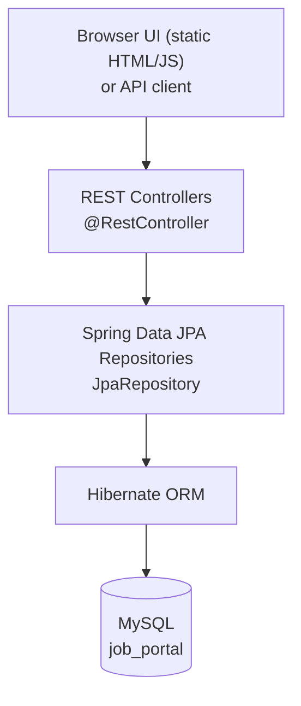
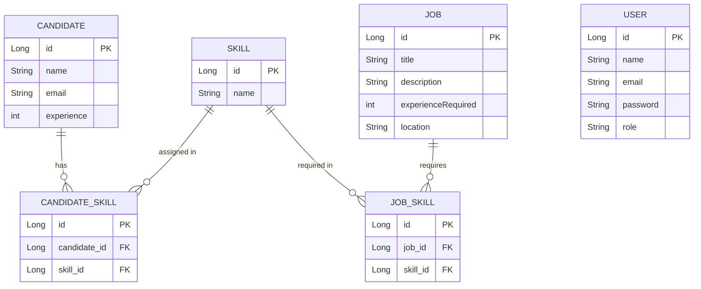
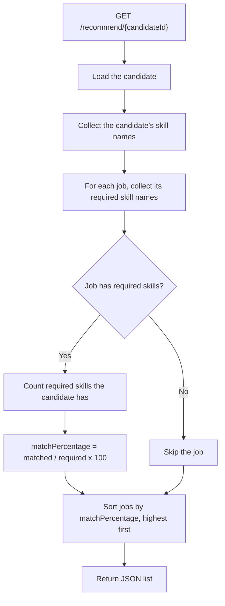

# AI-Based Skill Job Matching System

> A Spring Boot REST backend (with a small bundled web UI) that ranks jobs for a candidate by how many of each job's required skills the candidate has.


---

## Table of Contents

- [Overview](#overview)
- [Problem Statement](#problem-statement)
- [Key Features](#key-features)
- [System Architecture](#system-architecture)
- [Data Model](#data-model)
- [How Matching Works](#how-matching-works)
- [Tech Stack](#tech-stack)
- [API Reference](#api-reference)
- [Getting Started](#getting-started)
- [Project Structure](#project-structure)
- [Current Limitations & Future Improvements](#current-limitations--future-improvements)
- [Author](#author)

---

## Overview

This project matches candidates to jobs based on skills. You add candidates, jobs and skills, link skills to both candidates and jobs, and then ask the API for job recommendations for a given candidate. Each job comes back with a match percentage, sorted from best to worst.

It is built as a layered Spring Boot application: REST controllers talk to Spring Data JPA repositories, which persist everything to MySQL through Hibernate. A lightweight HTML/JS front end is served by the same Spring Boot app, so you can try the whole flow in a browser without any extra tooling.

**A note on "AI":** the matching is deterministic, rule-based skill overlap. There is no machine learning model in this repository.

---

## Problem Statement

### Problem
A candidate usually has several skills, and every job asks for a different combination. Comparing the two by hand gets slow and inconsistent as the number of jobs and skills grows.

### Solution
Skills are stored as first-class records and linked to candidates and jobs. For a given candidate, the system compares their skills against the required skills of every job and calculates a match percentage.

### Result
Instead of reading through every job, a single request returns a ranked list showing which jobs fit a candidate's skills best.

---

## Key Features

**Core data management**
- Create and list **candidates** (name, email, years of experience)
- Create and list **jobs** (title, description, experience required, location)
- Create and list **skills**

**Skill mapping**
- Assign skills to a candidate (`CandidateSkill` join entity)
- Assign required skills to a job (`JobSkill` join entity)

**Matching**
- `GET /recommend/{candidateId}` returns every job that has at least one required skill, with a `matchPercentage`, sorted highest first

**Accounts and UI**
- Basic register and login endpoints backed by a `User` entity
- Single-page HTML/CSS/JavaScript dashboard that covers every operation above, served from `src/main/resources/static`

**Developer experience**
- Maven Wrapper included, so no local Maven install is needed
- Hibernate `ddl-auto=update` creates and updates the tables automatically
- `test.http` with a ready-made request for quick API testing

---

## System Architecture

The application is a straightforward layered design. Controllers use the Spring Data repositories directly; there is no separate service layer.



| Layer | Package | Responsibility |
|---|---|---|
| Controller | `com.jobportal.controller` | Exposes REST endpoints, holds the matching logic in `RecommendationController` |
| Repository | `com.jobportal.repository` | `JpaRepository` interfaces for each entity (plus `findByEmail` for users) |
| Model | `com.jobportal.model` | JPA entities, with Lombok `@Data` for boilerplate |
| Static UI | `resources/static` | `index.html`, `script.js`, `style.css` calling the API with `fetch` |

---

## Data Model

Candidates and jobs are connected to skills through two join entities, which makes both relationships many-to-many. `User` is a standalone entity used by the register/login endpoints.



---

## How Matching Works

The logic lives in `RecommendationController`. For a candidate, it does the following:



**Formula**

```
matchPercentage = (required skills the candidate has / total skills the job requires) x 100
```

**Worked example:** a job requires Java, Spring Boot and MySQL. The candidate has Java and MySQL. That is 2 of 3 skills, so the match is 66.67%.

**Behaviour to be aware of**
- Skills are compared by exact name (case-sensitive), so `Java` and `java` are treated as different skills.
- Jobs with no assigned skills are left out of the results.
- The result only covers skill overlap. `experience` and `experienceRequired` are stored but not used in the score.
- A candidate who doesn't exist causes the request to fail with a "Candidate not found" runtime exception.

Response shape:

```json
[
  { "jobId": 1, "title": "Java Developer", "matchPercentage": 66.66666666666666 }
]
```

---

## Tech Stack

| Area | Technology |
|---|---|
| Language | Java 21 |
| Framework | Spring Boot 4.0.6 (Spring Web MVC) |
| Persistence | Spring Data JPA, Hibernate |
| Database | MySQL (`mysql-connector-j`) |
| Build | Maven (Maven Wrapper included) |
| Utilities | Lombok |
| Testing | Spring Boot test starters (JUnit 5) |
| Front end | Plain HTML, CSS and JavaScript (`fetch`) |

---

## API Reference

Base URL: `http://localhost:8081`

| Method | Endpoint | Description |
|---|---|---|
| `POST` | `/auth/register` | Save a user. Returns `REGISTER SUCCESS` |
| `POST` | `/auth/login` | Check email and password. Returns `LOGIN SUCCESS` or `INVALID CREDENTIALS` |
| `GET` | `/users` | Simple health check, returns `API working` |
| `POST` | `/users` | Create a user |
| `POST` | `/candidates` | Create a candidate |
| `GET` | `/candidates` | List candidates |
| `POST` | `/jobs` | Create a job |
| `GET` | `/jobs` | List jobs |
| `POST` | `/skills` | Create a skill |
| `GET` | `/skills` | List skills |
| `POST` | `/candidate-skill?candidateId={id}&skillId={id}` | Assign a skill to a candidate |
| `POST` | `/job-skill/assign?jobId={id}&skillId={id}` | Assign a required skill to a job |
| `GET` | `/recommend/{candidateId}` | Ranked job recommendations for a candidate |

**Try the full flow with curl**

```bash
# 1. Create skills
curl -X POST localhost:8081/skills -H "Content-Type: application/json" -d '{"name":"Java"}'
curl -X POST localhost:8081/skills -H "Content-Type: application/json" -d '{"name":"MySQL"}'

# 2. Create a candidate and a job
curl -X POST localhost:8081/candidates -H "Content-Type: application/json" \
  -d '{"name":"Asha","email":"asha@example.com","experience":2}'
curl -X POST localhost:8081/jobs -H "Content-Type: application/json" \
  -d '{"title":"Java Developer","description":"Spring Boot required","experienceRequired":2,"location":"Chennai"}'

# 3. Link skills (IDs assume a fresh database)
curl -X POST "localhost:8081/candidate-skill?candidateId=1&skillId=1"
curl -X POST "localhost:8081/job-skill/assign?jobId=1&skillId=1"
curl -X POST "localhost:8081/job-skill/assign?jobId=1&skillId=2"

# 4. Get recommendations
curl localhost:8081/recommend/1
```

---

## Getting Started

### Prerequisites
- JDK 21
- MySQL running locally on port `3306`

### 1. Clone the repository
```bash
git clone https://github.com/ChanduChowday25/Job_Recommondation_System.git
cd Job_Recommondation_System
```

### 2. Create the database
```sql
CREATE DATABASE job_portal;
```
Tables are created automatically on first run (`spring.jpa.hibernate.ddl-auto=update`).

### 3. Check the database credentials
The defaults in `src/main/resources/application.properties` are:

```properties
spring.datasource.url=jdbc:mysql://localhost:3306/job_portal
spring.datasource.username=root
spring.datasource.password=
server.port=8081
```
Update the username and password if your MySQL setup differs.

### 4. Run the application
```bash
./mvnw spring-boot:run        # macOS / Linux
mvnw.cmd spring-boot:run      # Windows
```

### 5. Open it
- Web UI: <http://localhost:8081>
- API: <http://localhost:8081/users> should return `API working`

### Running tests
```bash
./mvnw test
```
The only test is a Spring context-load test (`JobportalApplicationTests`), so it needs MySQL running with the configuration above.

---

## Project Structure

```
.
├── pom.xml
├── mvnw / mvnw.cmd
├── test.http                          # sample API request
└── src
    ├── main
    │   ├── java
    │   │   ├── com/jobportal/JobportalApplication.java
    │   │   ├── controller             # AuthController, CandidateController, JobController,
    │   │   │                          # SkillController, CandidateSkillController,
    │   │   │                          # JobSkillController, RecommendationController, UserController
    │   │   ├── model                  # Candidate, Job, Skill, CandidateSkill, JobSkill, User
    │   │   └── repository             # one JpaRepository per entity
    │   └── resources
    │       ├── application.properties
    │       └── static                 # index.html, script.js, style.css
    └── test/java/com/jobportal/JobportalApplicationTests.java
```

---

## Current Limitations & Future Improvements

This is an early-stage project. Listing the gaps openly, along with what I would do next:

| Area | Current state | Improvement |
|---|---|---|
| Authentication | Register/login compare plain-text passwords; no tokens or sessions; the UI only stores a login flag in `localStorage`; the `role` field is saved but not enforced | Hash passwords (BCrypt), add Spring Security with JWT, enforce roles |
| Architecture | Controllers call repositories directly | Add a service layer and DTOs |
| Validation and errors | No input validation; missing records raise generic runtime exceptions | Bean Validation and a global `@ControllerAdvice` with proper HTTP status codes |
| Matching | Exact, case-sensitive skill-name overlap; experience is ignored | Normalise skill names, weight skills, factor in experience and location |
| Performance | The recommendation endpoint loads all candidate-skill and job-skill rows for each job | Query by candidate/job ID in the repositories, or use join queries |
| API coverage | Create and list only | Update and delete endpoints, pagination |
| Data integrity | Duplicate skills or duplicate assignments are not prevented | Unique constraints on skill names and on candidate/job-skill pairs |
| Testing | One context-load test | Unit tests for the matching logic, integration tests for the controllers |
| Delivery | Local run only, credentials in `application.properties` | Externalise configuration, add Docker and CI |

---

## Author

**Chandu** · [GitHub: @ChanduChowday25](https://github.com/ChanduChowday25)
